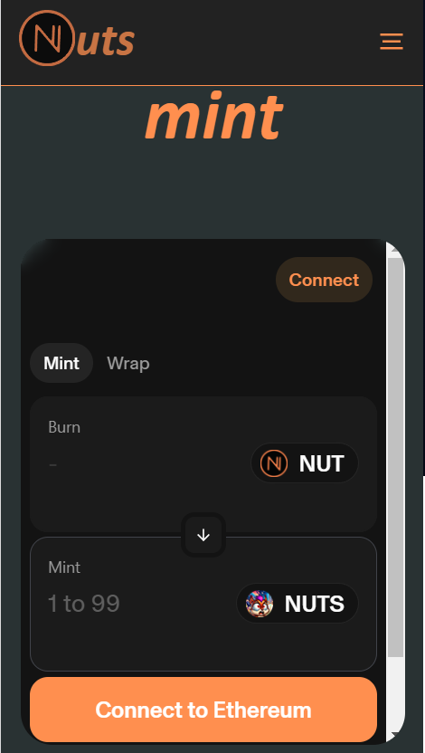

# Nutcoin Ecosystem Tokens 

_Disclaimer: This article focuses on Nutcoin Ecosystem tokens and does not provide any financial advices. All these tokens are experimental with no intrinsic value & no expectation of financial return (entertainment & experimental purposes only)._

Article also available on **Medium**: [here](https://medium.com/@nutcoin/nutcoin-ecosystem-tokens-6488fd4ff6f0) (without CoinMarketCap glossary links due to Medium restrictions)

# What are the Nutcoin Ecosystem tokens?

There are 5 [tokens](https://coinmarketcap.com/academy/glossary/token) which belong to Nutcoin Ecosystem, available on different [blockchains](https://coinmarketcap.com/academy/glossary/blockchain) and [decentralized exchanges](https://coinmarketcap.com/academy/glossary/decentralized-exchange-dex) (DEX). 

Each one of these tokens has unique properties and has been built for unique reasons.

## 1. Nutcoin (NUT)

|  |
|:--:|
| *Nutcoin (NUT) logo* |

**Name**: Nutcoin

**Symbol**: NUT

**Website**: [nutcoin.org](https://nutcoin.org)

**Short description**: NUT is a [memecoin](https://coinmarketcap.com/academy/glossary/memecoin) initially deployed on [Ethereum](https://coinmarketcap.com/currencies/ethereum/) blockchain with a fixed capped supply (21 trillion) and 100% of its [liquidity](https://coinmarketcap.com/academy/glossary/liquidity) locked. The token was created for entertainment purposes and for building a strong community around NUT memes creation.

**Token Contract (per blockchain):**

- **Ethereum:** 0x473F4068073Cd5b2aB0E4Cc8E146F9EDC6fb52CC
- **Arbitrum One:** 0x8697841b82c71fcbd9e58c15f6de68cd1c63fd02
- **Solana:** 3KkQ3AaMs2nZoKvYzGnh5bwRocAGFFFzDWUR4hLT7JpF
- **Wencash:** Not available yet
- **Nutchain:** Not available yet

**DEX (per blockchain) :**

- **Ethereum: Uniswap** — [app.uniswap.org/swap?outputCurrency=0x473F4068073Cd5b2aB0E4Cc8E146F9EDC6fb52CC&inputCurrency=ETH](https://app.uniswap.org/swap?outputCurrency=0x473F4068073Cd5b2aB0E4Cc8E146F9EDC6fb52CC&inputCurrency=ETH)
- **Arbitrum One: Uniswap** — [app.uniswap.org/swap?chain=arbitrum&outputCurrency=0x8697841B82C71fcbd9E58C15F6dE68CD1C63Fd02&inputCurrency=ETH](https://app.uniswap.org/swap?chain=arbitrum&outputCurrency=0x8697841B82C71fcbd9E58C15F6dE68CD1C63Fd02&inputCurrency=ETH)
- **Solana: Raydium** — [raydium.io/swap/?inputMint=sol&outputMint=3KkQ3AaMs2nZoKvYzGnh5bwRocAGFFFzDWUR4hLT7JpF](https://raydium.io/swap/?inputMint=sol&outputMint=3KkQ3AaMs2nZoKvYzGnh5bwRocAGFFFzDWUR4hLT7JpF)
- **Wencash: Nutswap** — Not available yet
- **Nutchain: Nutswap** — Not available yet

## 2. Nutcash (NCASH)

|  |
|:--:|
| *Nutcash (NCASH) logo* |

**Name**: Nutcash

**Symbol**: NCASH

**Website**: [nutcash.org](https://nutcash.org)

**Short description**: NCASH is a staking [memecoin](https://coinmarketcap.com/academy/glossary/memecoin) initially deployed on [Arbitrum One](https://coinmarketcap.com/currencies/arbitrum/) with a fixed capped supply (21 million). The token was created for entertainment purposes, for rewarding Nutcoin Ecosystem crypto communities by [staking](https://coinmarketcap.com/academy/glossary/staking) tokens and for granting access to Nutcoin Ecosystem [dApps](https://coinmarketcap.com/academy/glossary/decentralized-applications-dapps) (as a burning fee token) like [Nutgames dApp](https://nutgames.org/).

**Token Contract (per blockchain)**:

- **Ethereum:** 0xd105c45BCC7211F847Ae73B187A41b7D8184aDE2
- **Arbitrum One:** 0x88266f9eb705F5282a2507A9c418821a2AC9f8BD
- **Wencash:** Not available yet
- **Nutchain:** Not available yet

**DEX (per blockchain)**:

- **Ethereum: Uniswap** — [app.uniswap.org/swap?outputCurrency=0xd105c45BCC7211F847Ae73B187A41b7D8184aDE2&inputCurrency=ETH](https://app.uniswap.org/swap?outputCurrency=0xd105c45BCC7211F847Ae73B187A41b7D8184aDE2&inputCurrency=ETH)
- **Arbitrum One: Uniswap** — [app.uniswap.org/swap?chain=arbitrum&outputCurrency=0x88266f9eb705F5282a2507A9c418821a2AC9f8BD&inputCurrency=ETH](https://app.uniswap.org/swap?chain=arbitrum&outputCurrency=0x88266f9eb705F5282a2507A9c418821a2AC9f8BD&inputCurrency=ETH)
- **Wencash: Nutswap** — Not available yet
- **Nutchain: Nutswap** — Not available yet

## 3. Wencash (WEN)

|  |
|:--:|
| *Wencash (WEN) logo* |

**Name**: Wencash

**Symbol**: WEN

**Website**: [wencash.org](https://wencash.org)

**Short description**: WEN is the native [cryptocurrency](https://coinmarketcap.com/academy/glossary/cryptocurrency) of Wencash blockchain and it was initially deployed as a [token](https://coinmarketcap.com/academy/glossary/token) on [Ethereum](https://coinmarketcap.com/currencies/ethereum/) blockchain. Wencash is an experimental [Layer-1 blockchain](https://coinmarketcap.com/alexandria/glossary/layer-1-blockchain) based on the open source code of Ethereum. Main architectural difference with Ethereum is its native [Layer 2](https://coinmarketcap.com/academy/glossary/layer-2) called [Nutchain](https://www.nutchain.org/) and powered by [ZK miners](https://www.paradigm.xyz/2022/04/zk-hardware). 

As long as the Wencash blockchain and its bridge from/to Ethereum are not released, WEN token may be seen as a [memecoin](https://coinmarketcap.com/academy/glossary/memecoin) (relying on "WEN" memes) rather than an experimental coin.

**Token Contract (per blockchain)**:

- **Ethereum:** 0xEBA6145367b33e9FB683358E0421E8b7337D435f
- **Arbitrum One:** 0x860ea9299e9c297fbde64143cab2a3cb01945a27
- **Wencash:** Not Applicable (NA)
- **Nutchain:** Not available yet

**DEX (per blockchain)**:

- **Ethereum: Uniswap** — [app.uniswap.org/swap?outputCurrency=0xEBA6145367b33e9FB683358E0421E8b7337D435f&inputCurrency=ETH](https://app.uniswap.org/swap?outputCurrency=0xEBA6145367b33e9FB683358E0421E8b7337D435f&inputCurrency=ETH)
- **Arbitrum One:** Not available yet
- **Wencash: Nutswap** — Not available yet
- **Nutchain: Nutswap** — Not available yet

## 4. Nuts (NUTS)

|  |
|:--:|
| *Nuts (NUTS) logo* |

**Name**: Nuts

**Symbol**: NUTS

**Website**: [nuts.family](https://nuts.family)

**Short description**: NUTS is a collection of 10,000 unique Non Fungible Token ([NFT](https://academy.binance.com/en/articles/a-comprehensive-guide-to-nft-categories)) which grants some advantages: 

- Picture proof ownership for any use cases built on it (e.g. : [Nutgames featuring pools](https://nutgames.org/pool))
- Access to private clubs for [NUT](https://etherscan.io/token/0x473f4068073cd5b2ab0e4cc8e146f9edc6fb52cc#balances) & [NUTS](https://etherscan.io/token/0x88266f9eb705F5282a2507A9c418821a2AC9f8BD#balances) holders
- Direct communication with Nutcoin Ecosystem Devs

To [mint](https://academy.binance.com/en/glossary/mint) 1 new NUTS NFT, you need to [burn](https://coinmarketcap.com/academy/glossary/burned) 1 billion Nutcoin (NUT) tokens.

**Token Contract (per blockchain)**:

- **Ethereum:** 0x88266f9eb705F5282a2507A9c418821a2AC9f8BD
- **Arbitrum One:** 0xa844cb1b558625c8a6214d460f2fcfa599eb464a
- **Wencash:** Not available yet
- **Nutchain:** Not available yet

**DEX (per blockchain)**:

- **Ethereum: NUTS Minting dApp** — [nuts.family/en/#mint](https://nuts.family/en/#mint)
- **Ethereum: Opeansea** — [opensea.io/collection/nutsfamily](https://opensea.io/collection/nutsfamily)
- **Arbitrum One:** Not available
- **Wencash:** Not available
- **Nutchain:** Not available

## 5. Nuts404 (NUTS404)

|  |
|:--:|
| *Nuts404 (NUTS404) logo* |

**Name**: Nuts404

**Symbol**: NUTS404

**Website**: [nuts.family/en/#wrap](https://nuts.family/en/#wrap)

**Short description**: NUTS404 is a token obtained by locking NUTS NFT(s). 1 NUTS404 equals 1 NUTS but the main difference is that NUTS404 can be exchanged against other tokens on [liquidity pools](https://coinmarketcap.com/academy/glossary/liquidity-pool) like Uniswap pools because it is a fungible [ERC20](https://coinmarketcap.com/academy/glossary/erc-20) token. / ! \ As a result, when you lock your unique NUTS NFT to get 1 NUTS404, there is no garuantee to get back to the same unique NUTS NFT by locking your NUTS404.

**Token Contract (per blockchain)**:

- **Ethereum:** 0x25559f0aBBaf2A928239D2F419181147Cc2dAd74
- **Arbitrum One:** 0x37b2f564971d3bf986dc9e46ec587f42b75bde76
- **Wencash:** Not available yet
- **Nutchain:** Not available yet

**DEX (per blockchain)**:

- **Ethereum: NUTS Wraping dApp** — [nuts.family/en/#wrap](https://nuts.family/en/#wrap)
- **Arbitrum One:** Not available
- **Wencash:** Not available
- **Nutchain:** Not available

# How to bridge the Nutcoin Ecosystem tokens between the available blockchains?

## 1. Bridge NUT, WEN & NUTS404: Ethereum <> Arbitrum One — Native bridge

|  |
|:--:|
| *Ethereum & Arbitrum One logos* |

For Nutcoin (NUT), Wencash (WEN) and Nuts404 (NUTS404) tokens, the **native Arbitrum bridge** has been used to create a two-way bridge between Ethereum and Arbitrum One blockchains.

- Technical bridge details: [github.com/NutcoinOrg/nutcash/tree/main/arbitrum-erc20-bridge](https://github.com/NutcoinOrg/nutcash/tree/main/arbitrum-erc20-bridge)
- Arbitrum Official bridge: [bridge.arbitrum.io](https://bridge.arbitrum.io)

## 2. Bridge NUTS & NCASH: Ethereum <> Arbitrum One — Wormhole Portal bridge

|  |
|:--:|
| *Ethereum, Wormhole Portal & Arbitrum One logos* |

For Nuts (NUTS) and Nutcash (NCASH) tokens, the **Wormhole Portal bridge** has been used to create a two-way bridge between Ethereum and Arbitrum One blockchains.

- Technical bridge details for NUTS: [github.com/NutcoinOrg/nutcash/tree/main/arbitrum-erc721-wormhole-bridge](https://github.com/NutcoinOrg/nutcash/tree/main/arbitrum-erc721-wormhole-bridge)
- Wormhole Portal bridge for NUTS: [portalbridge.com/advanced-tools/#/nft](https://portalbridge.com/advanced-tools/#/nft)
- Wormhole Portal bridge for NCASH: [portalbridge.com/advanced-tools/#/transfer](https://portalbridge.com/advanced-tools/#/transfer)

## 3. Bridge NUT: Ethereum <> Solana — Wormhole Portal bridge

|  |
|:--:|
| *Ethereum, Wormhole Portal & Solana logos* |

For Nutcoin (NUT) token, the **Wormhole Portal bridge** has been used to create a two-way bridge between Ethereum and Solana blockchains.

- Wormhole Portal bridge for NUT: [portalbridge.com/advanced-tools/#/transfer](https://portalbridge.com/advanced-tools/#/transfer)

## 4. Bridge NUT, NCASH, NUTS, NUTS404 & WEN: Ethereum <> Wencash & Nutchain — Native Bridge (Nutbridge)

|  |
|:--:|
| *Ethereum & Wencash logos* |

For Nutcoin (NUT), Wencash (WEN), Nuts404 (NUTS404), Nuts (NUTS) and Nutcash (NCASH) tokens, the native bridge (**called Nutbridge, dApp of Nutcoin Ecosystem under construction**) will be used to create a two-way bridge between Ethereum and Wencash & Nutchain blockchains.

- Technical bridge details: [github.com/wencash/index?tab=readme-ov-file#bridge](https://github.com/wencash/index?tab=readme-ov-file#bridge)
- Nutbridge Official link: [nutbridge.org](https://nutbridge.org)

# How to buy / mint / wrap / stake the Nutcoin Ecosystem Token(s)?

**Prerequisites for buying on Ethereum or Arbitrum One DEX**:

- Download a blockchain wallet that supports Ethereum and Arbitrum One (e.g. [Metamask](https://metamask.io/), [Frame](https://frame.sh/), [Enkrypt](https://enkrypt.com/)) 
- Get some Ether (ETH), check [ethereum.org/en/get-eth](https://ethereum.org/en/get-eth/)
- Transfer some ETH to your wallet on Ethereum or Arbitrum One depending on where you want to buy the Nutcoin Ecosystem Token.

**Prerequisites for buying on Solana DEX**:

- Download a blockchain wallet that supports Solana (e.g. [Phantom](https://phantom.app/))
- Get some Solana coins (SOL), check [binance.com/en/how-to-buy/solana](https://binance.com/en/how-to-buy/solana) or [kraken.com/learn/buy-solana-sol](https://kraken.com/learn/buy-solana-sol) (or other way)
- Transfer some SOL to your wallet in order to buy NUT token on a Solana DEX.

## 1. Buy NUT, NCASH, NUTS404 & WEN on Ethereum — Uniswap DEX

|  |
|:--:|
| *Uniswap DEX with ETH on Ethereum* |

- Go to [app.uniswap.org/swap?inputCurrency=ETH](https://app.uniswap.org/swap?inputCurrency=ETH)
- Click on ‘Connect’ to connect your wallet
- Click on ‘Select token’ and past the contract address (check above here) of the chosen Nutcoin Ecosystem Token you want to buy (NUT, NCASH, NUTS404 or WEN)
- Enter the amount, do the swap and confirm wallet popups (if needed)

## 2. Buy NUT & NCASH on Arbitrum One — Uniswap DEX

|  |
|:--:|
| *Uniswap DEX with ETH on Arbitrum One* |

- Go to [app.uniswap.org/swap?chain=arbitrum](https://app.uniswap.org/swap?chain=arbitrum)
- Click on ‘Connect’ to connect your wallet
- Click on ‘Select token’ and past the contract address (check above here) of the chosen Nutcoin Ecosystem Token you want to buy (NUT or NCASH)
- Enter the amount, do the swap and confirm wallet popups (if needed)

## 3. Buy NUT on Solana — Raydium DEX

|  |
|:--:|
| *Raydium DEX with SOL & NUT on Solana* |

- Go to [raydium.io/swap/?inputMint=sol&outputMint=3KkQ3AaMs2nZoKvYzGnh5bwRocAGFFFzDWUR4hLT7JpF](https://raydium.io/swap/?inputMint=sol&outputMint=3KkQ3AaMs2nZoKvYzGnh5bwRocAGFFFzDWUR4hLT7JpF)
- Click on ‘Connect Wallet’ to connect your wallet
- Check that NUT token is already selected (previous url contains the contract address of NUT for Solana)
- Enter the amount, do the swap and confirm wallet popups (if needed)

## 4. Mint NUTS on Ethereum — Nuts Minting dApp

|  |
|:--:|
| *Nuts Minting dApp* |

- Go to [nuts.family/en/#mint](https://nuts.family/en/#mint)
- Click on ‘Connect’ to connect your wallet
- Enter the amount, do the NUTS mint (by burning NUT) and confirm wallet popups (if needed)

## 5. Wrap NUTS404 on Ethereum — Nuts Wrapping dApp

|  |
|:--:|
| *Nuts Wrapping dApp (two-way)* |

- Go to [nuts.family/en/#wrap](https://nuts.family/en/#wrap)
- Click on ‘Connect’ to connect your wallet
- NUTS > NUTS404: Enter the NFT id(s) seperated by “,” then do the wrap (lock NUTS to unlock NUTS404) and confirm wallet popups (if needed)
- NUTS404 > NUTS: Click on the down arrow, enter the amount, do the wrap (lock NUTS404 to unlock NUTS) and confirm wallet popups (if needed)

## 6. Stake NUT, NCASH, NUTS404, NUTS & WEN on Arbitrum One — Nutcash Staking dApp

Nutcoin Ecosystem tokens staking is only available on Arbitrum One blockchain for NUT, NCASH, NUTS404, NUTS & WEN with NCASH tokens as the rewards.

So users have to get then bridge Nutcoin Ecoystem tokens from Ethereum to Arbitrum One or buy straightly the tokens on Arbitrum One DEX (if available).

For now, there is no [Web3](https://coinmarketcap.com/academy/glossary/web-3-0) user interface for staking. Staking is currently and only available through interacting with [smart contracts](https://coinmarketcap.com/academy/glossary/smart-contract) using tools for advanced users.

- Official link: [nutcash.org/en/#staking](https://nutcash.org/en/#staking)
- Technical Details: [github.com/NutcoinOrg/nutcash](https://github.com/NutcoinOrg/nutcash)
- Nutcash Staking dApp: Not available yet

## 7. Buy NUT, NCASH & WEN on Wencash — Nutswap DEX

Not available yet.

- Nutswap Official link: [nutswap.org](https://nutswap.org)

## 8. Buy NUT, NCASH & WEN on Nutchain — Nutswap DEX

Not available yet.

- Nutswap Official link: [nutswap.org](https://nutswap.org)

--- 

*Don't hesitate to ask any questions or share what you think about the article on [x.com/@NutcoinOrg](https://twitter.com/NutcoinOrg), contact@nutcoin.org or [t.me/Nutcoin_EN](https://t.me/Nutcoin_EN)*
